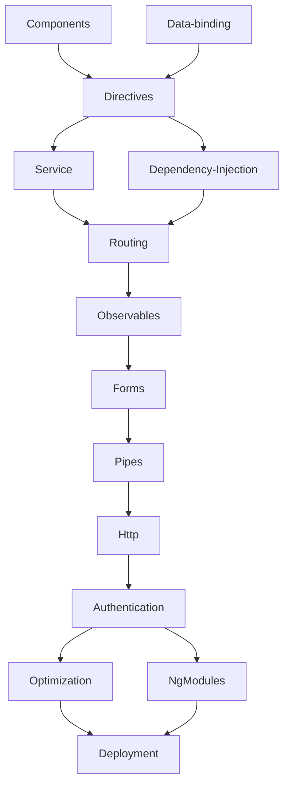
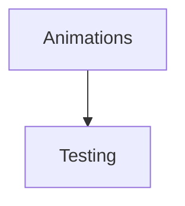

# angular-notes

```mermaid
graph TD;
    Components & Data-binding-->Directives;
    Directives-->Service & Dependency-Injection;
    Service & Dependency-Injection-->Routing;
    Routing-->Observables;
    Observables-->Forms;
    Forms-->Pipes;
    Pipes-->Http;
    Http-->Authentication;
    Authentication-->Optimization & NgModules;
    Optimization & NgModules-->Deployment;
```

```mermaid
graph TD;
    Animations-->Testing;
```
